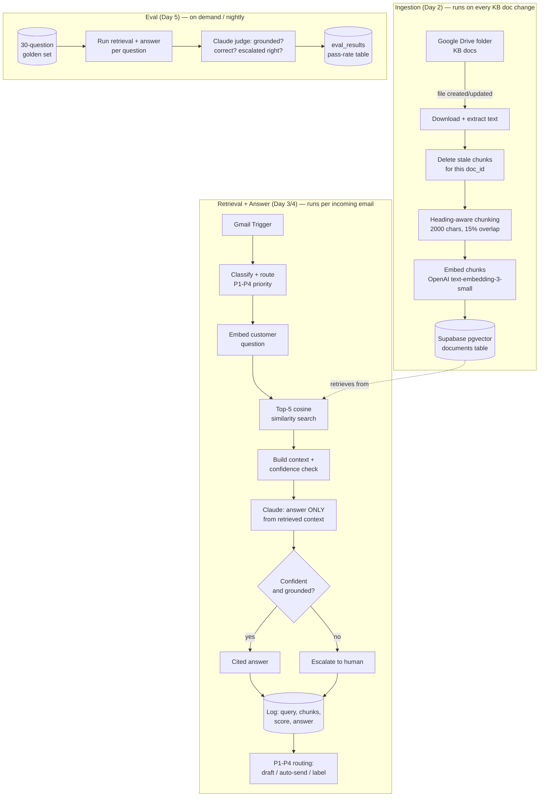

# RAG Support Knowledge Agent

Upgrades an existing production email-support automation — [`hush-email-automation`](https://github.com/vitaliiburorichnyi/hush-email-automation) — from hardcoded prompt rules to a real retrieval-augmented pipeline: answers are generated from a versioned knowledge base via vector search, cited by source, with automatic escalation when the knowledge base doesn't cover the question.

**The one-sentence pitch:** *My email support agent used to answer from hardcoded prompt rules. I rebuilt it to answer from a versioned knowledge base via vector search — grounded, cited, and evaluated on a 30-question golden set.*

## Architecture



## Stack

| Layer | Choice | Why |
|---|---|---|
| Vector DB | Supabase (Postgres + pgvector) | Plain SQL, HNSW index, self-hostable, no extra vendor — data already lives in Postgres |
| Embeddings | OpenAI `text-embedding-3-small` | 1536 dimensions, cheap, standard |
| Generation + judge | Claude Sonnet 4.6 | Already used elsewhere in this support system |
| Orchestration | n8n native LangChain nodes (Vector Store, Embeddings, Chain LLM) | Runs the whole pipeline without a custom backend |
| Observability | Supabase tables (`retrieval_logs`, `eval_results`) | Every request and every eval run is queryable, not just logged to text |

## Repo structure

```
rag-support-agent/
├── README.md
├── schema.sql                          # Supabase tables: documents, retrieval_logs, golden_eval_set, eval_results
├── eval_results.md                     # Full 30-question eval table + analysis
├── kb_docs/                            # 10 knowledge base source documents (markdown)
└── workflows/
    ├── day2_ingestion.json             # Drive → chunk → embed → upsert pgvector
    ├── day3_day4_email_rag.json        # Retrieval + grounded answer, wired into real P1-P4 routing
    └── day5_eval.json                  # Golden-set eval runner + LLM judge
```

## How it works, day by day

**Day 1 — Knowledge base.** 10 real support docs (shipping, returns, product care, sizing, FAQs, catalog, tone-of-voice) in a Supabase `documents` table: `content text`, `embedding vector(1536)`, `metadata jsonb` (doc_id, title, source_url, category), HNSW index for fast cosine search.

**Day 2 — Ingestion.** A Drive-triggered n8n workflow watches the KB folder. On any new or edited file: download → extract text → chunk (markdown-heading-aware, 2000 chars, 15% overlap) → embed → delete that doc's old chunks → insert the new ones. Editing a doc and re-saving it fully refreshes the vector store with no manual steps.

**Day 3 — Retrieval, wired into a real production workflow.** Not a standalone demo — this slots into an existing Gmail-based P1-P4 support triage system ([`hush-email-automation`](https://github.com/vitaliiburorichnyi/hush-email-automation)), replacing its prompt-rule answer step. Incoming email → embed the question → top-5 similarity search → Claude answers *only* from the retrieved chunks, citing the source doc → if any part of the question isn't covered, the whole reply is escalated instead of a mixed partial answer.

**Day 4 — Guardrails + observability.** A 0.65 cosine-distance threshold (validated empirically, see below) forces escalation on low-confidence retrievals. Every request — question, retrieved chunk titles/scores, final answer, escalation reason — logs to `retrieval_logs` *before* any Gmail action runs, so a Gmail-side failure can never erase the audit trail.

**Day 5 — Evals.** 30 golden Q&A pairs (21 answerable, 9 genuinely out-of-KB) run through the full pipeline, judged by Claude against the actual retrieved context (not just a summary) for groundedness, correctness, and escalation-correctness. Full table and methodology notes in `eval_results.md`.

**Day 6 (this doc) — Ship.**

## Eval results

**20/21 answerable correct (95%) · 21/21 grounded (100%) · 9/9 out-of-KB correctly escalated (100%)**

Full per-question table, the two documented edge cases, and the three-iteration methodology story (a mislabeled golden question, a real model inference gap, and a judge design bug — all found and fixed, not swept under the rug) are in [`eval_results.md`](./eval_results.md).

## Known limitations / failure modes handled

- **Threshold overlap zone.** Answerable questions score 0.36–0.67 cosine distance; out-of-KB questions score 0.59–0.74. The 0.59–0.67 band is ambiguous by construction — no single hard threshold perfectly separates them (see eval case #16).
- **Stale chunks after doc edits.** Handled by delete-by-`doc_id` on every re-ingest, so an edited policy doc never leaves orphaned old chunks searchable alongside the new version.
- **Mixed answerable/unanswerable questions.** A single customer email can ask one covered question and one uncovered one. The system is instructed to treat the whole reply as needing escalation rather than mixing a real answer with a raw escalation marker — this exact bug was caught and fixed during testing (see commit history / build notes).
- **Prompt-injection surface.** Retrieved context and the customer's email are both treated as data passed to the model, never as instructions — the system prompt is fixed and doesn't get overridden by content inside the retrieved chunks or the customer's message.
- **Silent parameter corruption in Postgres logging.** n8n's `queryReplacement` comma-separated shorthand splits on *any* comma in the resolved string — including commas inside ordinary customer text — silently shifting every parameter after it. Fixed by passing a single array-valued expression instead of a comma-joined template string. Real bug, found via testing with realistic (comma-containing) input, not a hypothetical.

## Interview talking points

1. **Why heading-aware chunking beats fixed-size splitting** — policy docs have semantic boundaries (a "Refund timing" section shouldn't be split mid-sentence into two chunks).
2. **Why pgvector over Pinecone** — data already lives in Postgres, no extra vendor, plain SQL; Pinecone starts winning past ~10M vectors, this KB is low thousands.
3. **The escalation threshold is a measured trade-off, not a guess** — see the eval table for the actual score distributions and where they overlap.
4. **A hard guardrail can overcorrect** — tightening the anti-hallucination prompt to fix one gap (Bitcoin case) introduced a new one-question regression (trade-in case). Real systems trade one failure mode for another; the job is measuring it, not assuming a fix is free.
5. **What I'd do at 10x scale** — re-ranking on top of the vector search, hybrid keyword+vector search, per-tenant namespaces if this served multiple stores.

## Setup

1. Create a Supabase project, enable the `vector` extension, run `schema.sql`.
2. Import the three workflow JSONs into n8n; set your own Postgres, OpenAI, and Anthropic credentials (referenced by name only in the exports — no keys included).
3. Point `day2_ingestion.json`'s Drive trigger at your own KB folder; drop the `kb_docs/*.md` files in there to seed it.
4. Wire `day3_day4_email_rag.json`'s retrieval nodes into your own email-routing workflow (or run it standalone against a manual trigger for a demo).
5. Seed `golden_eval_set` with your own Q&A pairs and run `day5_eval.json` to get a pass-rate baseline before changing anything in production.
